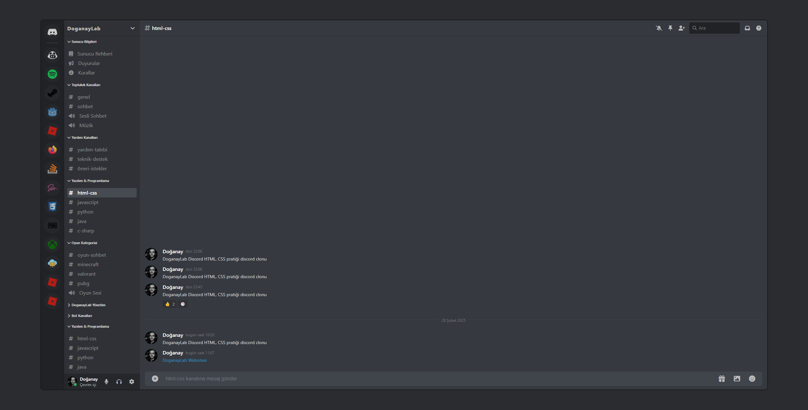

# HTML & CSS Discord Klonu Projesi

Bu proje, HTML ve CSS yeteneklerini geliştirmek ve pratik yapmak amacıyla oluşturulmuş bir Discord kullanıcı arayüzü klonudur. Temel amacı, modern CSS ve HTML yapılarını kullanarak kompleks bir arayüzü yeniden oluşturmak ve bu teknolojilerdeki becerilerimi ilerletmektir.

## Proje Amacı

- HTML ve CSS konusunda pratik yapmak
- Karmaşık arayüzleri kodlama becerilerini geliştirmek
- CSS'in flexbox ve CSS nesting kullanımını öğrenmek
- Web sayfası düzeni ve tasarım prensiplerini uygulamak
- Gerçek dünya uygulamalarının arayüzlerini inceleyip klonlayarak öğrenmek

## Kullanılan Teknolojiler & Özellikler

- **HTML5**: Semantik etiketler ve modern yapılandırma
- **CSS3**: Flexbox, CSS nesting
- **Font Awesome 6.7.2**: İkonlar için kullanıldı

## Öğrenilen CSS Teknikleri

- CSS nesting ile daha okunabilir stil kodları
- Flexbox ile kompleks yerleşim düzenleri
- Scrollbar gizleme tekniği (`scrollbar-width: none`) - tarayıcılar arası uyumluluk için
- CSS transitions ufak ile animasyonlar
- Hover efektleri ve durum değişimleri
- Position: relative ve position: absolute ile öğe konumlandırma
- Detaylı form stillemeleri

## Tasarım Kararları

- **Scrollbar'ların Gizlenmesi**: Farklı tarayıcılarda scrollbar'ların tutarsız ve çirkin görünmesini önlemek için `scrollbar-width: none` kullandım. CSS ile Google Chrome ve Edge'de scrollbar'ı yeterince kişiselleştiremediğim için gizlemeyi tercih ettim.
- **Flexbox Kullanımı**: Henüz Grid yapısına hiç bakmadığım için yerine Flexbox tercih edildi.
- **Renk Paleti**: Birebir aynı olmasada Discord'un orijinal karanlık temasını taklit eden renk paleti kullanıldı.

## Proje Yapısı

- `index.html`: Ana HTML yapısı
- `style.css`: Tüm stillemeler
- `img/`: Proje görselleri ve ikonları
- `favicon/`: Favicon dosyaları

## Nasıl Kullanılır

1. Projeyi klonlayın veya ZIP olarak indirin
2. `index.html` dosyasını tarayıcınızda açın
3. Kodları inceleyerek HTML ve CSS yapılarını öğrenin
4. Kendi değişikliklerinizi yaparak pratik yapın

## Geliştirme İçin Fikirler

- CSS Grid kullanarak alternatif bir düzen oluşturma
- JavaScript ekleyerek mesaj gönderme fonksiyonalitesi ekleme
- Local Storage kullanarak mesajları saklama
- Karanlık/aydınlık tema geçişi ekleme
- Responsive yapıyı geliştirerek mobil uyumluluk sağlama
- Emoji picker eklemek
- Özelleştirilmiş ve stil verilmiş scrollbar tasarımı eklemek (tüm tarayıcılarla uyumluluğu test ederek)

## İletişim

DoganayLab - [https://doganaylab.com](https://doganaylab.com)